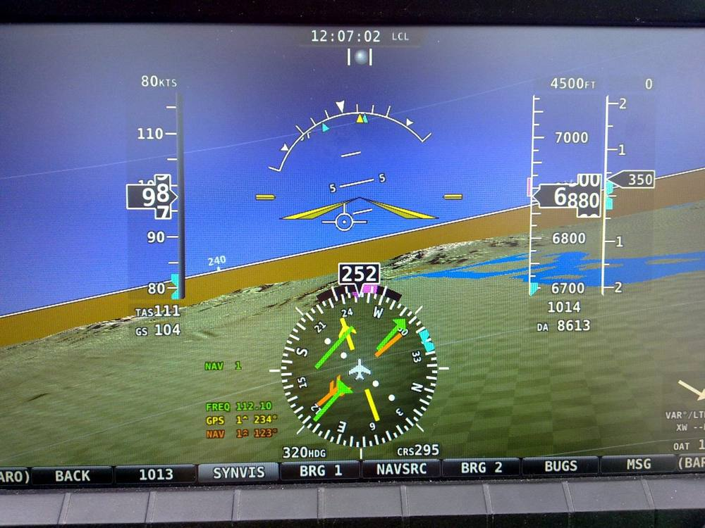
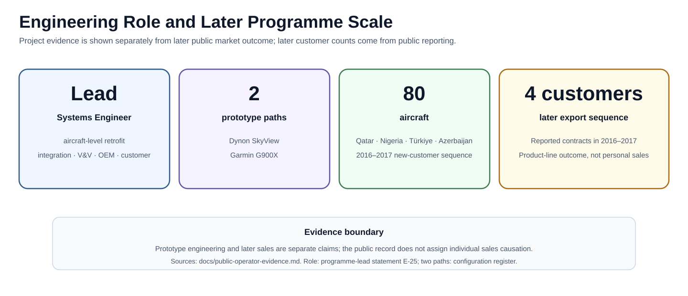

# Super Mushshak Glass-Cockpit Retrofit

**Lead Systems Engineer · aircraft-level avionics integration · prototype ground/flight verification · customer evaluation**

I led systems integration for the historical glass-cockpit retrofit, connecting sensing, avionics, the modification harness and aircraft interfaces through test, troubleshooting and OEM coordination. This case supports lead/principal systems-integration and technical-programme roles.

**Start here:** [Engineering decisions and test record](docs/engineering-case-study.md) · [Verification and limits](docs/assurance-closure-summary.md) · [Original photographs](docs/media-gallery.md) · [Current digital thread](docs/mbse-digital-thread.md).

**Ownership:** aircraft modification was multidisciplinary team delivery. My role and full sensor/harness scope are retrospective programme-lead statements ([E-24/E-25](docs/evidence-register.md)); period photographs and technical records support configuration-specific activity. Later exports are wider programme outcomes. The current CSV model and diagrams are retrospective work; an executable digital twin remains planned.

[Applied AI & autonomous systems portfolio](https://github.com/razaumair2203-ux/applied-ai-portfolio) · [Contact / request a releasable technical review](https://www.linkedin.com/in/mumairaza/)

## Executive snapshot

<table>
<tr>
<td align="center"><b>Lead Systems Engineer</b> aircraft-level retrofit ownership</td>
<td align="center"><b>2 prototype paths</b> Dynon SkyView · Garmin G900X</td>
<td align="center"><b>Complete modification scope</b> sensors · harness · avionics · power · HMI</td>
<td align="center"><b>Ground + flight V&amp;V</b> discrepancy isolation · OEM action · re-test</td>
</tr>
</table>

The modification replaced/reworked the aircraft sensing chain, introduced a **complete modification wiring harness**, integrated modern display and navigation/communication equipment, and matured the aircraft through installed ground and flight testing. My programme role also extended into **in-country Qatar customer-evaluation support and Dubai Airshow display activity**, taking the engineering work into an international customer-facing environment.

The programme developed two principal prototype paths: **Dynon SkyView** and **Garmin G900X**. A project comparison deck also contains **Garmin G3X** candidate material; that remains trade-study evidence and is kept separate from the G900X prototype identity.

### Programme evidence at a glance

  

<b>Installed avionics in flight.</b> Original project photograph showing the Dynon glass-cockpit configuration operating on the aircraft during flight-test activity.

## Engineering flow

**operational need → architecture & trade studies → sensor / avionics / harness integration → ground integration → flight test → discrepancy isolation → OEM engineering action → configuration update → re-test → customer evaluation → product maturity**

This is the level at which the work was executed: the **aircraft was the system boundary**. Display selection was only one element of a coupled modification involving sensing, power/protection, data and audio interfaces, retained avionics, installation, maintainability, software/settings/databases and pilot/instructor HMI.

## Aircraft-level architecture

[Functional architecture](docs/system-context-and-functions.md) · [Configuration evolution](docs/configuration-management.md)

The diagrams are current systems-engineering representations of the executed programme. They communicate architecture, interface ownership, configuration discipline and V&amp;V structure while keeping controlled installation detail, pin-level interconnects and proprietary drawings outside the public repository.

## Prototype identity & configuration control

| Configuration | Engineering identity |
|---|---|
| **CFG-000** | legacy aircraft baseline |
| **CFG-D1** | Dynon initial installed prototype |
| **CFG-D2** | Dynon post-replacement / reconfiguration state |
| **CFG-D3** | Dynon performance / customer-evaluation state |
| **CFG-G1** | Garmin G900X prototype / evaluation path |
| **CMP-G3X** | Garmin G3X comparison artefact — trade study only |

This separation is deliberate: requirements, interfaces, discrepancies and V&amp;V results remain tied to the **as-tested configuration**.

## Verification, troubleshooting & re-flight

The project record shows an installed-aircraft engineering loop:

**observe → isolate interface / configuration → engineer with OEM → implement hardware / configuration action → restore settings / data → re-test / re-flight**

  

<b>Installed-aircraft sortie context.</b> Original period photograph showing the aircraft operating in the real flight-test environment.

The machine-readable model in [model/](model/README.md) links requirements, functions, interfaces, configurations, verification records, issues, risks, decisions and supporting evidence.

## International product-line outcome

The engineering programme progressed through prototype development, flight test, customer evaluation and public display activity. Public reporting subsequently shows the glass-cockpit Super Mushshak product line scaling into a multi-country export programme.

| Customer / operator | Publicly reported quantity | Public evidence |
|---|---:|---|
| **Qatar** | 8 | [APP contract report](https://www.app.com.pk/national/pakistan-inks-accord-to-supply-8-mushshak-aircraft-to-qatar/) |
| **Nigeria** | 10 | [APP delivery report](https://www.app.com.pk/national/pakistan-supplies-four-super-mushshak-to-naf/) |
| **Türkiye** | 52 | [APP contract report](https://www.app.com.pk/national/pakistan-to-supply-52-trainer-aircraft-to-turkey/) |
| **Azerbaijan** | 10 | [APP sale report](https://www.app.com.pk/national/pakistan-signs-agreement-with-azerbaijan-for-sale-of-10-super-mushshak-aircraft/) |
| **2016–2017 new-customer sequence** | **80** | customer totals above |

Specialist reporting also states that the two-display glass-cockpit Super Mushshak appeared publicly at **Dubai Airshow 2011**, with Dynon and Garmin versions available, and that by 2024 **more than 100 Super Mushshaks had been upgraded or sold with new avionics since 2016**. See [Independent Public Evidence](docs/public-operator-evidence.md).

### Programme-value context

Reported commercial values and their limitations are kept in the [public-source context note](docs/programme-value-context.md). They are not personal revenue, retrofit-only value or evidence that prototype work alone caused subsequent orders.

## Why this project matters

| Systems-engineering dimension | Evidence in this portfolio |
|---|---|
| **Architecture & trade studies** | distinct Dynon / Garmin prototype paths; candidate comparison discipline |
| **Interface engineering** | aircraft power, revised sensing, NAV/COM, audio, retained avionics, data/settings |
| **Physical integration** | complete modification harness and aircraft installation scope |
| **Configuration management** | as-tested hardware/software/settings state tied to V&amp;V evidence |
| **Verification & validation** | installed checks, flight observations, discrepancy isolation, re-test |
| **Supplier / OEM engineering** | technical coordination through observed issues and configuration actions |
| **Customer-facing delivery** | international evaluation / demonstration context |
| **Product lifecycle** | supportability, spares/repair logic and digital-thread continuation |

## Historical evidence and current digital engineering

The programme is now being carried forward into a **digital-engineering / digital-twin initiative**. Original project evidence and engineering knowledge are structured as:

**claims → requirements → functions → interfaces → configurations → verification → issues / risks → decisions**

The proposed next stage is an executable Super Mushshak digital twin using releasable engineering data for interface behaviour, failure-state logic, maintenance / health state, data replay and verification scenarios.

## Public-release scope

Detailed wiring, pin-level interconnects, proprietary installation drawings, private correspondence, personal data and restricted material are intentionally omitted. Published aircraft and cockpit photographs are **original project images**. They are not cropped or zoomed for presentation; any processing is limited to non-generative image-quality improvement such as exposure/contrast correction, sharpening, metadata removal and strictly necessary privacy/security treatment.  **No synthetic aircraft or cockpit imagery is used.**

## Technical record

- [Systems-engineering case study](docs/engineering-case-study.md)
- [System context and functions](docs/system-context-and-functions.md)
- [Architecture and trade study](docs/architecture-trade-study.md)
- [Interface control](docs/interface-control.md)
- [Configuration management](docs/configuration-management.md)
- [Verification and flight test](docs/verification-and-flight-test.md)
- [Traceability and V&V](docs/traceability-and-vv.md)
- [Integration risk register](docs/integration-risk-register.md)
- [International customer evaluation and programme context](docs/field-evaluation-and-programme-context.md)
- [Independent public evidence](docs/public-operator-evidence.md)
- [Public programme-value context](docs/programme-value-context.md)
- [Project media gallery](docs/media-gallery.md)
- [Evidence register](docs/evidence-register.md)
- [MBSE / digital-thread representation](docs/mbse-digital-thread.md)
- [Digital twin follow-on](docs/digital-twin.md)
- [Sources](docs/references.md)
- [Machine-readable systems model](model/README.md)

**Quality gate:** `python tools/validate_model.py` checks model IDs, typed references, local links and local image paths.
