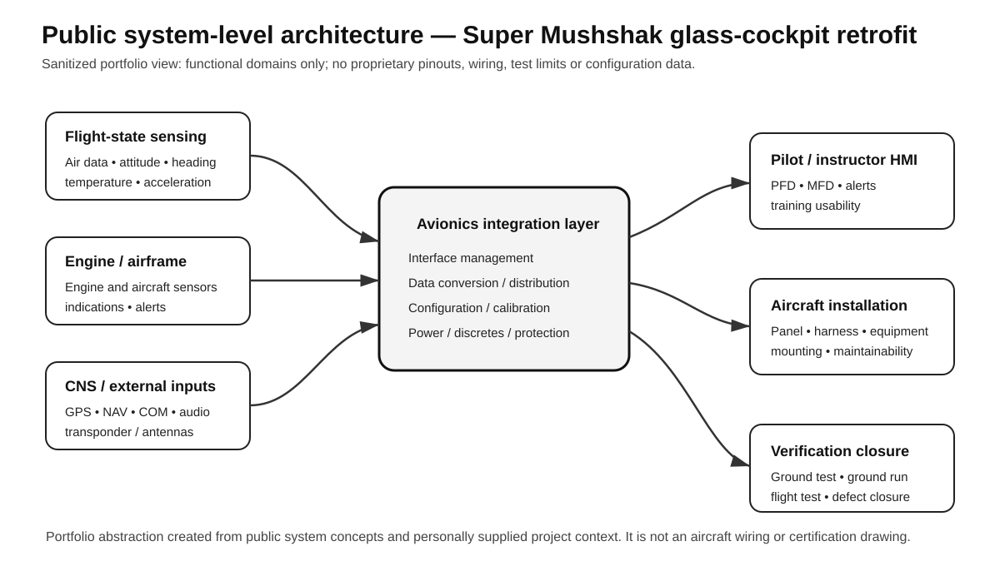

# Super Mushshak Glass-Cockpit Modification

**Systems engineering • avionics integration • prototype development • verification & flight test**

This repository is a **public, recruiter-facing engineering case study** of the early Super Mushshak glass-cockpit modification programme. It is intentionally limited to information that is either already public, personally owned, or explicitly cleared for public release.

> **Public-release rule:** no internal drawings, proprietary wiring data, detailed pinouts, restricted test data, customer-sensitive material, or unreviewed programme documents are published here.

## Why this project matters

The engineering problem was not simply to replace analogue gauges with screens. The modification required an aircraft-level integration effort across:

- digital primary-flight and multifunction displays;
- air-data, attitude/heading, navigation and engine/airframe sensing;
- communication/navigation equipment;
- aircraft electrical power and protection;
- panel redesign and human-machine-interface constraints;
- complete wiring-harness changes and equipment interconnects;
- ground integration, functional verification and flight-test activity.

Early programme work included **Dynon SkyView** and **Garmin-family glass-flight-deck** configurations. The exact configuration history of the early Garmin prototype is being verified against archival programme records before a model designation is stated here.

## My role

**System Engineering Lead / Avionics Integration & Test Engineer — early prototype programme**

My contribution covered the systems-engineering and verification side of the modification, including:

- requirements decomposition and architecture trade studies;
- avionics/sensor-suite selection and interface definition;
- integration of displays, navigation/communication equipment and aircraft sensors;
- aircraft wiring-harness/interface coordination;
- prototype integration and troubleshooting;
- ground-test and flight-test support;
- technical evaluation during overseas trials;
- support to the aircraft's international demonstration activity.

The purpose of this repository is to show the **engineering method, integration depth and verification evidence** behind that work without disclosing controlled programme information.

## Publicly documented programme evolution

The early glass-cockpit demonstrator was publicly shown at the **Dubai Airshow in 2011**. Later production/export literature identifies **Garmin G950** and **Dynon SkyView** as Super Mushshak glass-cockpit options.

Public sources subsequently document substantial adoption:

- **Qatar:** 8 aircraft contract announced in 2016.
- **Nigeria:** 10 aircraft; public handover reporting explicitly described the aircraft as glass-cockpit equipped.
- **Türkiye:** 52-aircraft contract.
- **Azerbaijan:** 10-aircraft contract.
- Pakistan's Ministry of Defence Production reported **glass-cockpit modification of 20 Super Mushshak aircraft** for PAF / Pakistan Army during 2017–18.

These later contracts are presented here as **programme-level context**, not as a claim that any one engineer or one prototype alone caused the exports.

## Case-study structure

| Area | What a recruiter can inspect |
|---|---|
| [Engineering case study](docs/engineering-case-study.md) | Problem framing, systems-engineering scope, interfaces, trade-offs |
| [Sanitized architecture trade study](docs/sanitized-trade-study.md) | Real decision criteria from the early candidate evaluation, with sensitive detail removed |
| [Verification & flight test](docs/verification-and-flight-test.md) | V&V logic, ground/flight test approach, evidence boundaries |
| [Programme impact](docs/programme-impact.md) | Publicly documented adoption and later programme evolution |
| [Evidence matrix](docs/evidence-matrix.md) | Which claims are public, personal-record based, or still awaiting verification |
| [Public-release register](PUBLIC_RELEASE_REGISTER.md) | Recruiter value vs disclosure risk for every candidate artifact |
| [Public sources](docs/public-sources.md) | Traceable external evidence used in this repository |

## Engineering themes demonstrated

Systems Engineering · Avionics Integration · Requirements · Interface Control · Architecture Trade Studies · Wiring & Harness Integration · PFD/MFD · AHRS/ADAHRS · Air Data · Navigation/Communication · V&V · Ground Test · Flight Test · Troubleshooting · Customer Trials

## Disclosure note

This is **not** an official PAC, PAF or customer repository. It is a personal engineering portfolio case study. Detailed programme documents remain private unless independently confirmed as suitable for public release.
