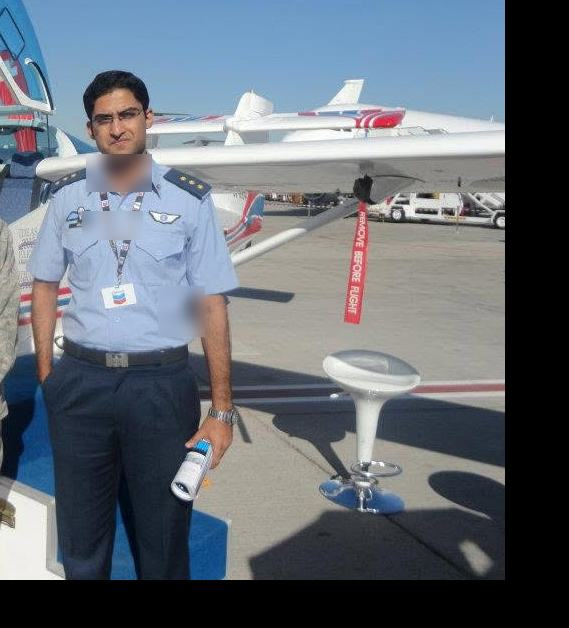

# Super Mushshak Glass-Cockpit Retrofit

**Aircraft-level systems engineering · avionics integration · prototype V&V · flight-test feedback · customer evaluation**

*Original project photograph of the Dynon SkyView prototype cockpit. The image is cropped/redacted only; no synthetic aircraft or cockpit imagery is used in this repository.*

This repository documents my work as **lead systems engineer / avionics integration engineer** on the Super Mushshak glass-cockpit retrofit. The engineering problem was broader than replacing instruments: it involved the aircraft sensor suite, cockpit displays, navigation/communication equipment, electrical integration, wiring-harness changes, databases and configuration, maintainability, OEM coordination, ground/flight test, and customer evaluation.

The repository is reconstructed retrospectively from surviving period records and original photographs. It deliberately separates **what the evidence demonstrates** from what is merely plausible.

## Engineering scope

- replacement/integration of flight-state and engine/airframe sensing;
- glass-cockpit PFD/MFD/EMS functions and associated controls;
- Garmin 430-family navigation/communication integration on the Dynon track;
- ARINC-429 and other avionics-interface work;
- aircraft electrical integration, protection and transient troubleshooting;
- complete aircraft harness / installation changes associated with the modification;
- avionics databases, software/settings and configuration restoration;
- maintainability, spares, LRU replacement and OEM support considerations;
- installed-aircraft functional checks, flight-test feedback and re-test;
- customer-facing technical evaluation and prototype support.

## Prototype identities: kept deliberately separate

### Dynon SkyView prototype

The strongest surviving evidence is on the Dynon track: original cockpit and in-flight photographs, direct OEM engineering exchanges, installed-aircraft troubleshooting, ARINC/GNS integration, database/configuration activity, and repeated flight-test feedback.

### Garmin G900X / G950-family prototype and evaluation track

A separate Garmin G900X/G950-family track was developed/evaluated. Surviving material includes G900X/G950 architecture documentation, a Qatar-focused G950 technical presentation, and later G900X configuration-mode correspondence.

### Garmin G3X comparative material

A 2012 comparison presentation evaluates **Dynon SkyView against Garmin G3X**. That deck is retained as evidence of trade-study practice only. It is **not relabelled as the G900X/G950 prototype**, because doing so would merge distinct configurations.

## Evidence-backed engineering loop

~~~mermaid
flowchart LR
    A[Aircraft modernisation need] --> B[Requirements & constraints]
    B --> C[Architecture / COTS trade study]
    C --> D[Prototype configuration]
    D --> E[Installation & functional checks]
    E --> F[Flight test]
    F --> G[Observed behaviour / discrepancy]
    G --> H[Engineering + OEM resolution]
    H --> I[Configuration update]
    I --> E
~~~

This is a **retrospective systems-engineering model** of documented activity, not an original programme diagram.

## Selected visual record

<table>
<tr>
<td width="50%"> Original in-flight display photograph: installed-aircraft PFD / synthetic-vision evidence.</td>
<td width="50%"> Original ground-evaluation photograph from the Qatar customer-evaluation period; identifying background details redacted.</td>
</tr>
<tr>
<td width="50%"> Installed Dynon prototype cockpit. Internal placard redacted.</td>
<td width="50%"> Original Dubai Airshow support photograph; service insignia/credential detail redacted.</td>
</tr>
</table>

## Retrospective MBSE evidence

The MBSE material in this repository is not decorative. The historical evidence has been normalised into linked engineering objects:

**evidence → requirement/constraint → interface → configuration → verification → decision**

See:

- [MBSE retrospective](docs/mbse-retrospective.md)
- [Structured model](model/README.md)
- [Requirements](model/requirements.csv)
- [Interfaces](model/interfaces.csv)
- [Verification records](model/verification.csv)
- [Configuration states](model/configurations.csv)
- [Decision records](model/decisions.csv)
- [Traceability](model/traceability.csv)

The model is intentionally public-safe: no pinouts, harness routes, controlled drawings, precise equipment locations, security markings, private customer correspondence, or confidential vendor data are published.

## Technical case-study map

- [Systems engineering case study](docs/engineering-case-study.md)
- [Architecture and trade study](docs/architecture-trade-study.md)
- [Verification and flight test](docs/verification-and-flight-test.md)
- [Qatar evaluation and programme context](docs/field-evaluation-and-programme-context.md)
- [Evidence register](docs/evidence-register.md)
- [Digital twin follow-on](docs/digital-twin.md)
- [Sources and release boundary](docs/references.md)

## From retrofit to digital engineering

The current **Super Mushshak Digital Twin** is a separate follow-on effort. The retrofit archive provides real configuration history, interfaces, decisions, discrepancies and verification evidence that can seed a modern digital thread. The twin will increase in fidelity only where releasable evidence supports it.
