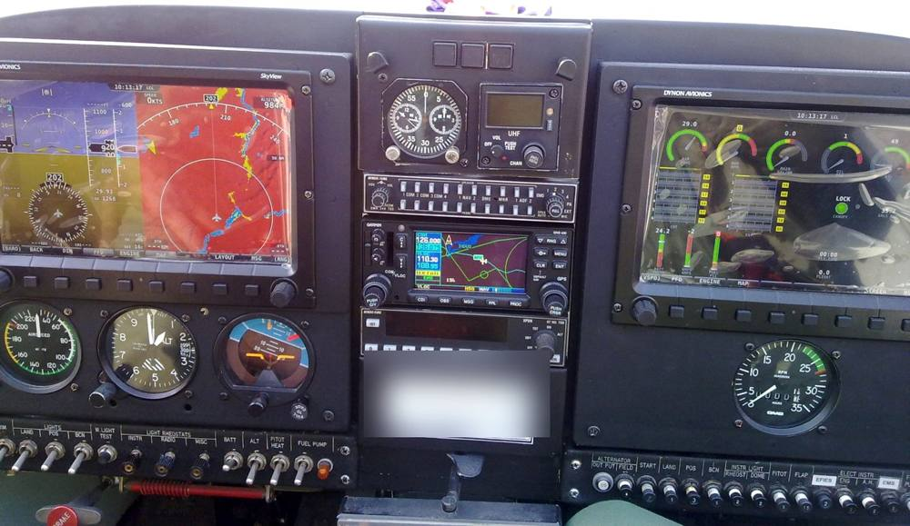
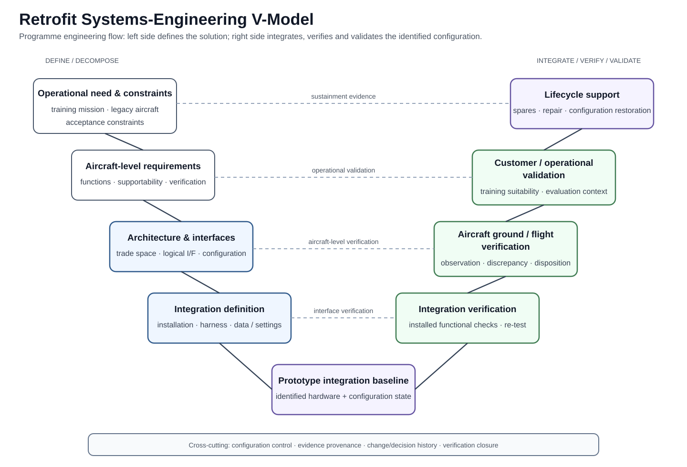
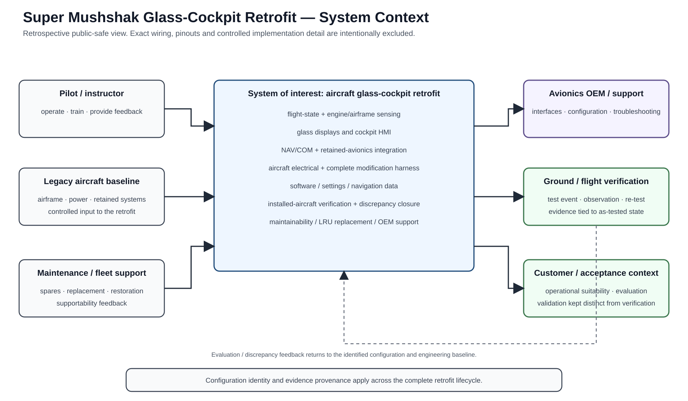
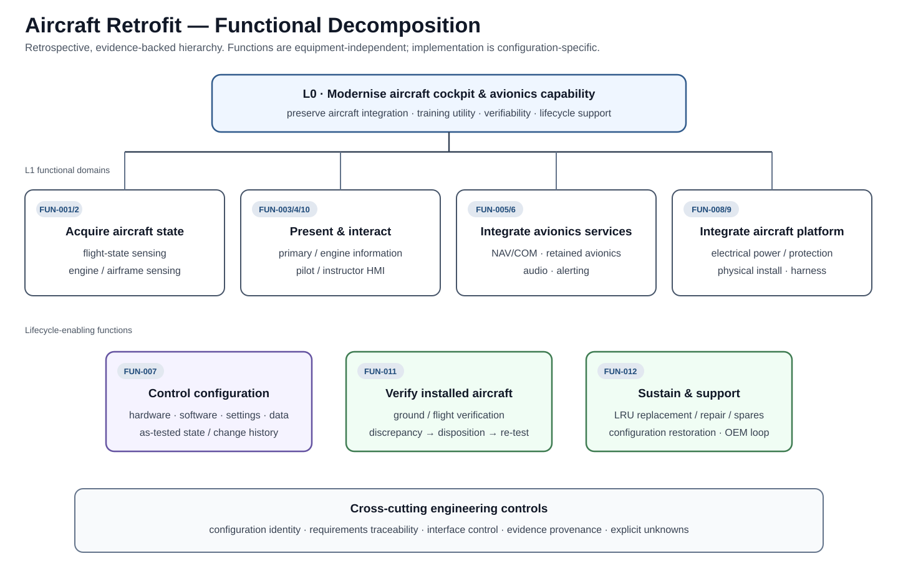
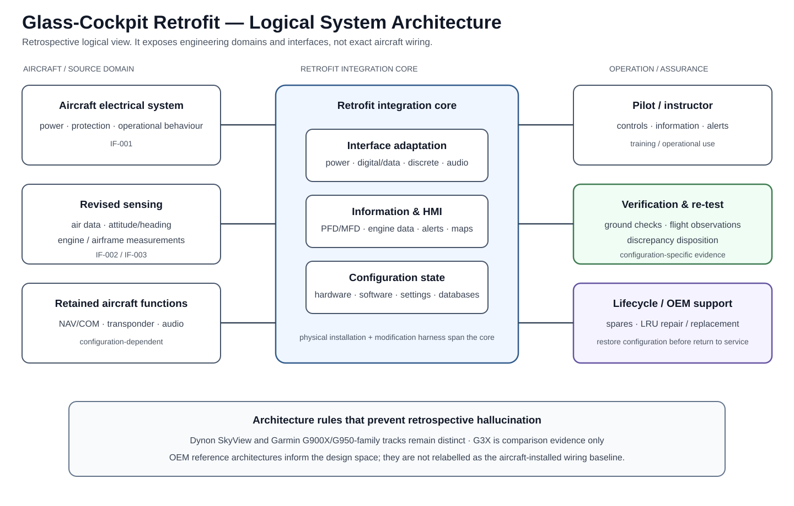
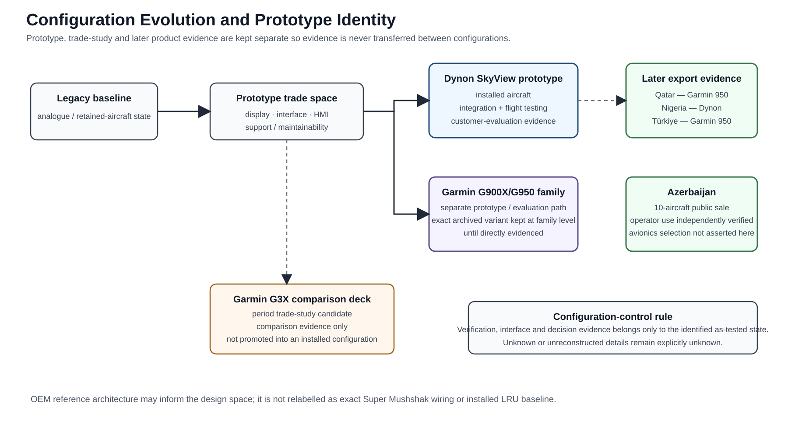
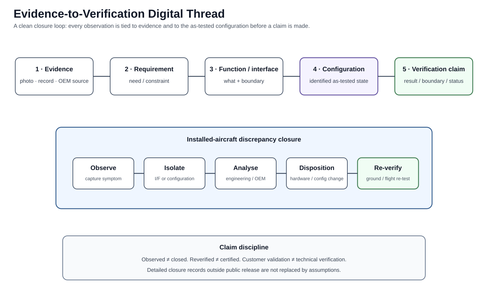
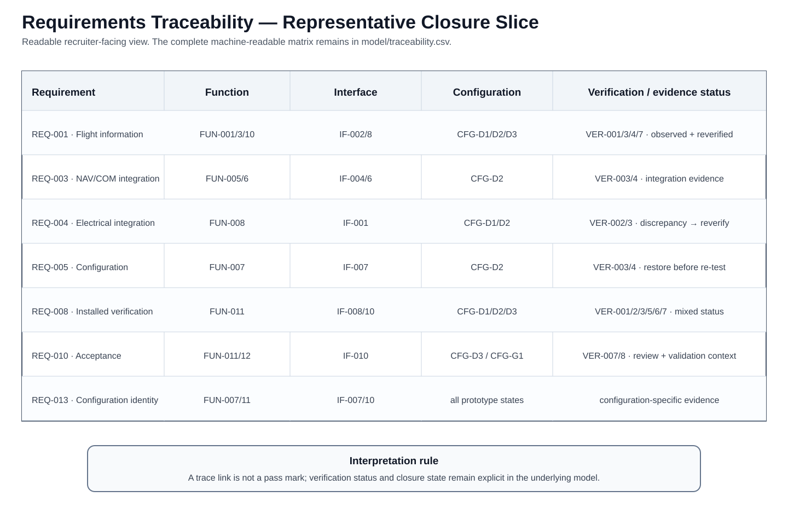
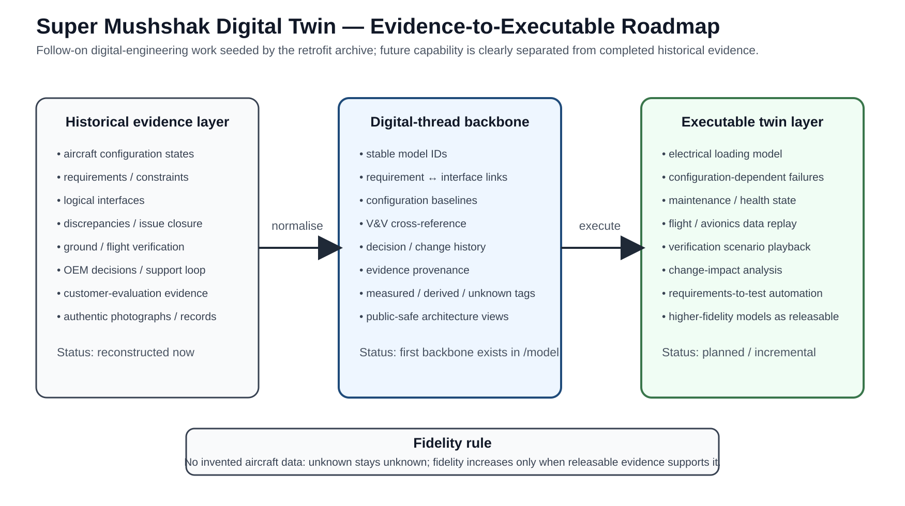

# Super Mushshak Glass-Cockpit Retrofit

**Lead Systems Engineer portfolio · aircraft-level avionics integration · dual prototype paths · ground/flight test · international customer evaluation · configuration control · export product lineage · MBSE / digital-twin continuation**

<table>
<tr>
<td width="34%"></td>
<td width="33%"></td>
<td width="33%"></td>
</tr>
<tr>
<td><b>Installed prototype:</b> Dynon SkyView glass-cockpit integration.</td>
<td><b>Flight test:</b> installed cockpit operating in the aircraft test programme.</td>
<td><b>Customer evaluation:</b> project aircraft during international evaluation activity.</td>
</tr>
</table>

## Programme scope and role

I was the **Lead Systems Engineer** for the Super Mushshak glass-cockpit retrofit. This was an **aircraft-level modification**, not a display replacement. The engineering scope included:

- two prototype paths: **Dynon SkyView** and **Garmin G900X**;
- replacement / integration of the aircraft sensing suite;
- redesign and installation of the **complete modification wiring harness**;
- integration of displays, engine/airframe information, NAV/COM, audio and retained avionics;
- aircraft electrical-power, protection, physical-installation and HMI considerations;
- hardware/software/database configuration control;
- ground integration, flight test, discrepancy isolation and re-test;
- OEM technical coordination and international customer-evaluation support.

A project comparison deck also evaluates **Garmin G3X** as part of the wider candidate trade study. It is kept separate from the G900X prototype identity so the configurations are not conflated.

## Engineering flow

**operational need → architecture and trade studies → equipment / sensor / harness integration → ground integration → flight test → discrepancy isolation → OEM engineering action → configuration update → re-test → customer evaluation / product maturity**

The programme required systems engineering across **architecture, interfaces, configuration, V&V, maintainability and stakeholder coordination**. The diagrams and machine-readable model express that executed engineering work in a modern MBSE / digital-thread form for technical communication and future digital-twin development.

## Aircraft-level architecture

The system boundary is the **aircraft**. The retrofit coupled four major domains:

- **flight and engine sensing**;
- **cockpit displays, HMI and alerts**;
- **NAV/COM, audio and retained-avionics interfaces**;
- **aircraft power, physical installation and the complete modification harness**.

<table>
<tr>
<td width="50%"></td>
<td width="50%"></td>
</tr>
</table>

These are **current systems-engineering representations of the executed retrofit programme**. They intentionally remain at logical/interface level for public release; controlled installation detail, pin-level interconnects and proprietary drawings are outside this repository.

## Prototype identity and configuration control

| ID | Configuration |
|---|---|
| **CFG-000** | legacy aircraft baseline |
| **CFG-D1** | Dynon initial installed prototype |
| **CFG-D2** | Dynon post-replacement / reconfiguration state |
| **CFG-D3** | Dynon performance / customer-evaluation state |
| **CFG-G1** | Garmin G900X prototype / evaluation path |
| **CMP-G3X** | Garmin G3X comparison artefact — trade study only |

Configuration identity matters because observations, software/settings state and V&V results are meaningful only against the **as-tested configuration**.

## Verification and discrepancy closure

Project test and troubleshooting records show a real installed-aircraft engineering loop:

**observe → isolate interface / configuration → engineer with OEM → implement hardware / configuration action → restore settings / data → re-test / re-flight**

The machine-readable model in [model/](model/README.md) links requirements, functions, interfaces, configurations, verification records, issues, risks, decisions and supporting evidence.

## International programme impact

The prototype programme progressed into international customer evaluation and public display activity. My project role included customer-trial support and the engineering work required to mature the integrated aircraft configuration.

Independent reporting then shows the glass-cockpit Super Mushshak product path entering substantial multi-country service:

- [Times Aerospace, 2017](https://www.timesaerospace.aero/features/defence/nigeria-opts-for-super-mushshaks) reported that the two-display glass-cockpit Super Mushshak first appeared publicly at **Dubai Airshow 2011**, with Dynon and Garmin versions available.
- [Asian Military Review, 2019](https://www.asianmilitaryreview.com/2019/01/super-mushshaks-super-popular/) documented an **80-aircraft** new-customer sequence in 2016–2017: **Qatar 8, Nigeria 10, Türkiye 52 and Azerbaijan 10**; it identified Qatar and Türkiye with Garmin 950 and Nigeria with Dynon.
- [Times Aerospace, 2024](https://www.timesaerospace.aero/sites/aerospace/times/files/magazines/2024/das24-wds-d3/content/das24-wds-d3.pdf) reported that **more than 100 Super Mushshaks had been upgraded or sold with new avionics since 2016**, using Dynon, GenesyS or Garmin systems.

| Customer / operator | Publicly reported quantity | Evidence |
|---|---:|---|
| **Qatar** | 8 | [APP contract report](https://www.app.com.pk/national/pakistan-inks-accord-to-supply-8-mushshak-aircraft-to-qatar/) + [Qatar News Agency](https://qna.org.qa/en/news/news-details?date=23%2F01%2F2024&id=0033-hh%C2%A0the-amir-patronizes%C2%A0graduation-ceremony-of%C2%A0al-zaeem-air-academy) |
| **Nigeria** | 10 | [APP delivery report](https://www.app.com.pk/national/pakistan-supplies-four-super-mushshak-to-naf/) + [Nigerian Air Force](https://airforce.mil.ng/news/pakistan-to-strengthen-technical%2C-defence-cooperation-with-nigerian-air-force361186473) |
| **Türkiye** | 52 | [APP contract report](https://www.app.com.pk/national/pakistan-to-supply-52-trainer-aircraft-to-turkey/) + [Türkiye Ministry of National Defence](https://www.msb.gov.tr/SlaytHaber/1d609ba0df7c40039347230972cec89b) |
| **Azerbaijan** | 10 | [APP / programme sale report](https://www.app.com.pk/national/pakistan-signs-agreement-with-azerbaijan-for-sale-of-10-super-mushshak-aircraft/) |
| **2016–2017 total** | **80** | [Asian Military Review](https://www.asianmilitaryreview.com/2019/01/super-mushshaks-super-popular/) |

Later production / export configurations evolved; this repository therefore keeps prototype identities and later product variants distinct rather than implying that every export aircraft reproduced an early prototype unchanged.

## Digital thread → digital twin

The programme is now being carried forward into a **digital-engineering / digital-twin initiative**. Original project evidence and engineering knowledge are being structured into:

**claims → requirements → functions → interfaces → configurations → verification → issues / risks → decisions**

The next step is an executable Super Mushshak digital twin using releasable engineering data for interface behaviour, failure-state logic, maintenance / health state, data replay and verification scenarios.

## Public-release scope

Detailed wiring, pin-level interconnects, proprietary installation drawings, private correspondence, personal data and restricted material are intentionally omitted. Published aircraft and cockpit photographs are **original project images**; processing is limited to crop, resize, exposure/contrast correction, sharpening and narrowly targeted privacy/security redaction. **No synthetic aircraft or cockpit imagery is used.**

## Technical record

- [Systems-engineering case study](docs/engineering-case-study.md)
- [System context and functions](docs/system-context-and-functions.md)
- [Architecture and trade study](docs/architecture-trade-study.md)
- [Interface control](docs/interface-control.md)
- [Configuration management](docs/configuration-management.md)
- [Verification and flight test](docs/verification-and-flight-test.md)
- [Traceability and V&V](docs/traceability-and-vv.md)
- [Integration risk register](docs/integration-risk-register.md)
- [International customer evaluation and programme context](docs/field-evaluation-and-programme-context.md)
- [Independent public evidence](docs/public-operator-evidence.md)
- [Project media gallery](docs/media-gallery.md)
- [Evidence register](docs/evidence-register.md)
- [MBSE / digital thread representation](docs/mbse-digital-thread.md)
- [Digital twin follow-on](docs/digital-twin.md)
- [Sources](docs/references.md)
- [Machine-readable systems model](model/README.md)

**Quality gate:** `python tools/validate_model.py` checks ID uniqueness, reference integrity, typed links and local Markdown/image paths.
