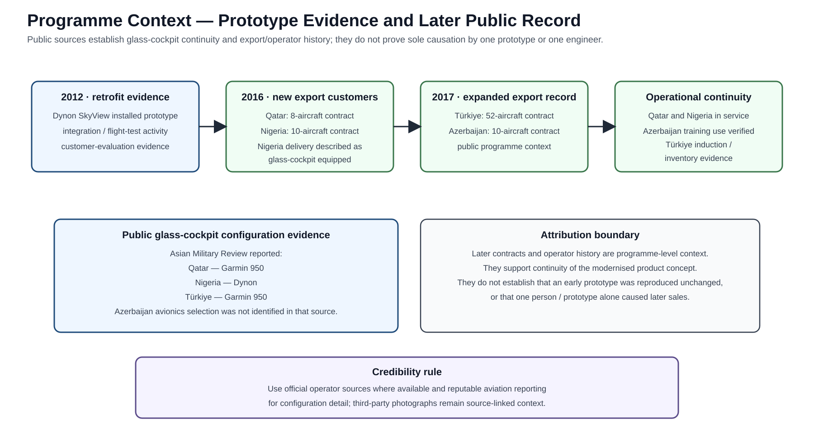

# Customer Evaluation and Programme Context

## International customer evaluation

Project status and test records show the Dynon-configured aircraft progressing from integration and performance-test activity into international customer evaluation. My role extended beyond integration-shop activity into **customer-facing test/evaluation support**, including the Qatar evaluation phase and Dubai Airshow programme activity described in the programme record.

A period status record documents **10 evaluation sorties by 12 November 2012**, including a night-flying mission. Engineering exchanges from the same phase record continuing configuration observations and OEM feedback during customer flying.

  

*International programme-support context. Authentic period photograph from Dubai Airshow activity, retained to document the customer-facing/display phase of the programme. It does not establish a technical performance result by itself.*

*Project photograph from the customer-evaluation period.*

## Lead Systems Engineer contribution

As **Lead Systems Engineer**, my responsibility spanned the aircraft-level modification rather than a single display or LRU:

- system architecture and integration trade space;
- integration of displays/HMI with revised sensing, aircraft power, retained avionics, NAV/COM and the complete modification harness;
- prototype ground and flight test;
- discrepancy isolation, reconfiguration and re-verification;
- OEM technical coordination;
- customer-evaluation support.

## Verification versus customer validation

The engineering loop remained configuration-controlled: installed checks and flight observations generated discrepancies, discrepancies drove engineering/OEM action, and changes were re-tested on an identified aircraft configuration.

Customer flying added the operational layer: usability, workload, environmental operation, maintainability and suitability in the intended training context.

## From prototype to export product

Independent reporting shows the glass-cockpit product path expanding after the initial development work:

| Customer | Quantity | Public glass-cockpit / avionics evidence |
|---|---:|---|
| **Nigeria** | 10 | APP describes delivered aircraft as **glass-cockpit equipped**; Asian Military Review identifies **Dynon** |
| **Qatar** | 8 | Asian Military Review identifies **Garmin 950**; Qatar News Agency records continuing Super Mushshak use at Al Zaeem Air Academy |
| **Türkiye** | 52 | Asian Military Review identifies **Garmin 950**; Turkish Ministry of National Defence records aircraft entering inventory |
| **Azerbaijan** | 10 | sale confirmed by APP quoting PAC/PAF; avionics selection not identified in the cited specialist article |
| **2016–2017 total** | **80** | four new-customer contracts |

The larger trajectory continued: [Times Aerospace reported in 2024](https://www.timesaerospace.aero/sites/aerospace/times/files/magazines/2024/das24-wds-d3/content/das24-wds-d3.pdf) that **more than 100 Super Mushshaks had been upgraded or sold with new avionics since 2016**, using Dynon, GenesyS or Garmin systems.

This establishes the programme trajectory: aircraft-level glass-cockpit engineering progressed through prototype integration, flight test and customer evaluation into a durable international Super Mushshak product line. Configuration-specific claims remain tied to the source that identifies them.

For the public commercial scale of that later product-line outcome, see [Public Programme-Value Context](programme-value-context.md).

## Sources and imagery

- [Independent public evidence](public-operator-evidence.md)
- [Project + independent media gallery](media-gallery.md)
- [Sources](references.md)
