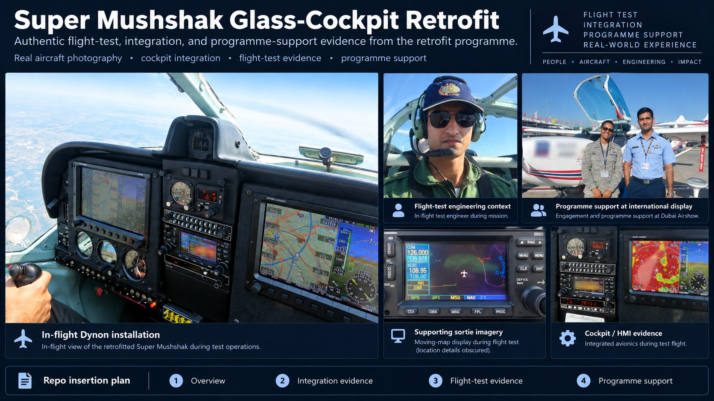
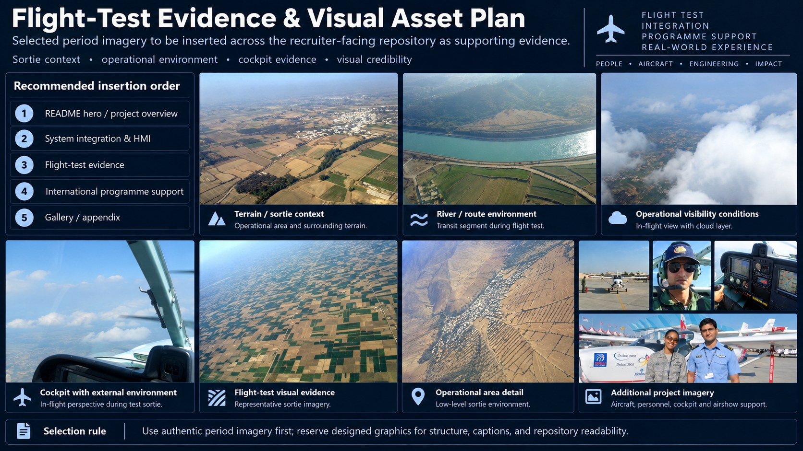
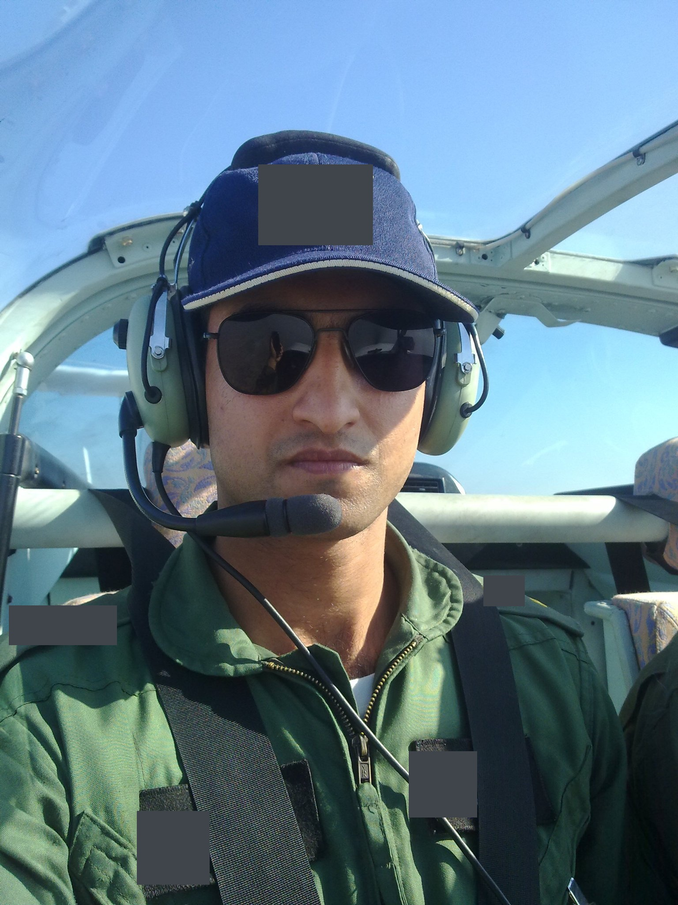
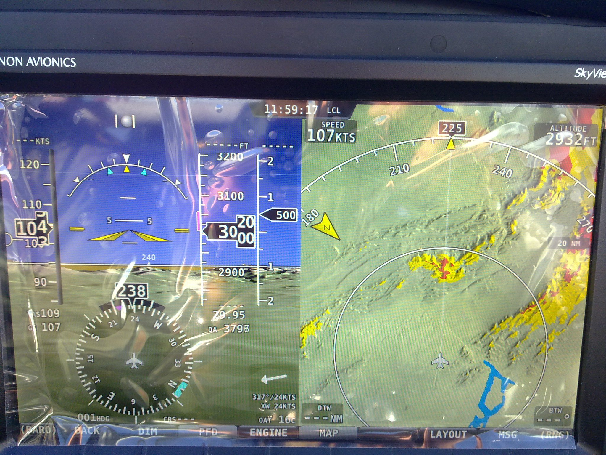
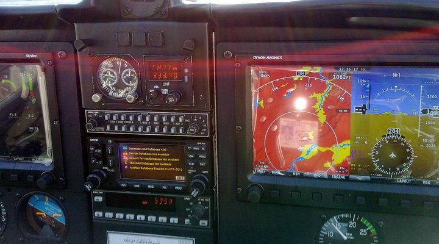
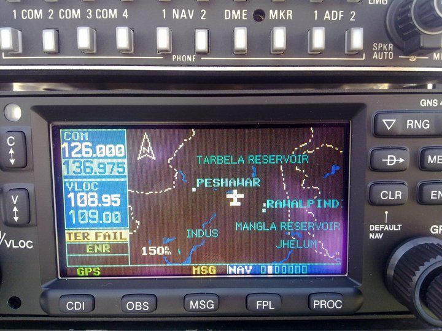
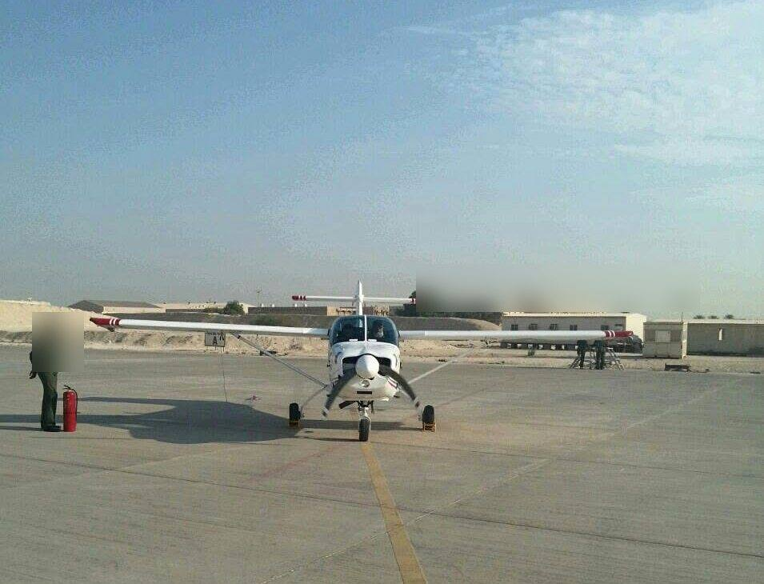
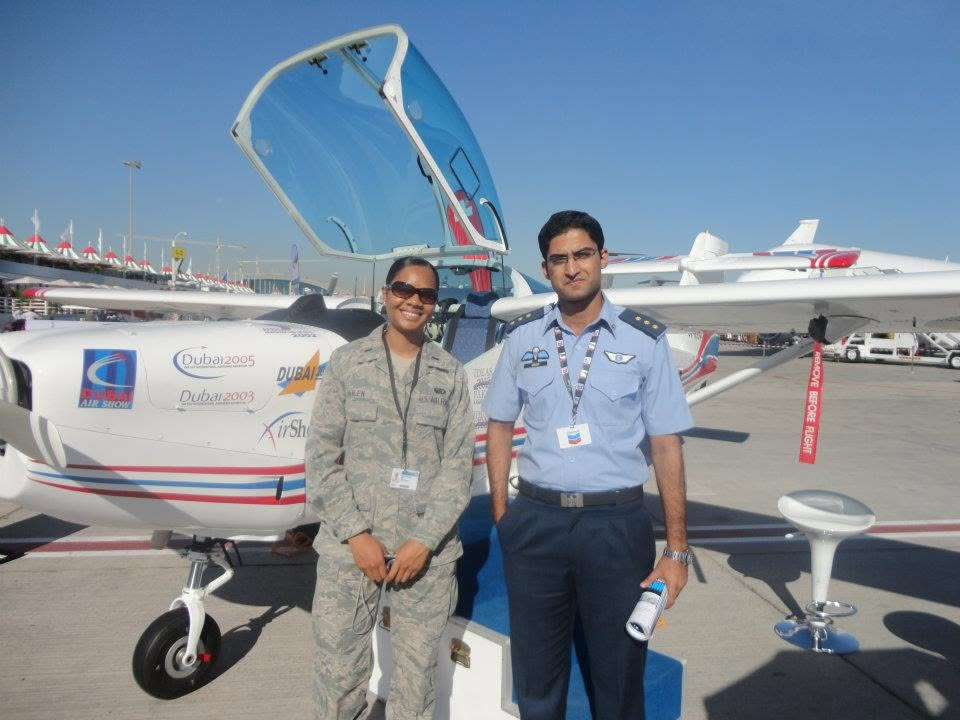

# Project Media Gallery

The photographs below are **original project imagery**. They establish three things immediately: an installed aircraft configuration existed, it was operated in flight, and the programme progressed into international customer evaluation.

## Visual-selection rule

The gallery uses **individual original photographs in context**, not newly assembled collages. The only composite visuals permitted are programme boards explicitly supplied and approved by the programme lead. Original photographs are shown without crop or zoom.

The aerial album records the **real sortie environment, changing visibility, terrain, route context, and cockpit operation**. Selected photographs are placed individually where they support the engineering story.

## Programme-lead-approved evidence boards

  

**Recruiter-facing programme overview.** This approved board assembles authentic period project imagery with explanatory labels for rapid scanning. It does not replace the individual photographs or the configuration-specific engineering record.

  

**Flight-test visual evidence plan.** This approved board organizes authentic cockpit, sortie/environment and programme-support imagery. Individual images remain the evidentiary source for the claims they can support.

  

**Installed Dynon SkyView prototype — aircraft integration, not a bench demonstration.**  
The retrofit combined displays, revised sensing, NAV/COM and retained-avionics interfaces, aircraft power, physical installation and a complete modification wiring harness.

## Lead systems engineer / flight-test context

  

**Flight-test engineering context.** Original period photograph of the programme lead during an aircraft sortie.

## Installed-aircraft flight test

  

**Installed-aircraft flight test.** The glass-cockpit configuration was exercised in flight with configuration-specific observations feeding engineering, OEM action and re-test.

## HMI and avionics integration

  

**Dynon HMI evidence.** Full-frame original showing the installed display during programme operations.

  

**Cockpit / centre-stack integration.** Original project photograph showing how the display suite, retained instruments and centre-stack equipment were integrated at aircraft level.

  

**NAV/COM integration evidence.** Original project photograph supporting the retained-avionics and navigation/communication interface story.

## Sortie environment

  

**Whole-cockpit in-flight context.** Original period image showing the integrated cockpit during programme flying.

  

**Terrain / sortie context.** Original period aerial photography from the programme.

  

**Route environment.** Original period photography retained as operational evidence.

  

**Visibility conditions.** Original period image showing atmospheric conditions encountered during programme flying.

## International customer evaluation

  

**QAEF ground customer-evaluation context.** Original period project photograph from the Qatar evaluation phase, retained prominently because it documents the transition from prototype flight test into customer-facing evaluation.

  

**International programme support / display context.** Authentic period project photograph from Dubai Airshow activity. It supports the programme-facing narrative and does not by itself establish a technical-performance result.

## What the images establish

| Visual evidence | Engineering significance |
|---|---|
| Installed cockpit | real aircraft-level integration of the avionics suite and retained systems |
| In-flight display / cockpit operation | the configuration progressed through installed-aircraft V&V |
| Customer-evaluation context | the engineering programme moved into external evaluation rather than stopping at prototype assembly |

## Public product-line evidence

Independent reporting provides the later market context without replacing the project imagery:

| Evidence | What it establishes |
|---|---|
| [Times Aerospace — Nigeria opts for Super Mushshaks](https://www.timesaerospace.aero/features/defence/nigeria-opts-for-super-mushshaks) | the two-display glass-cockpit Super Mushshak appeared publicly at Dubai Airshow 2011; Dynon and Garmin versions were available |
| [Associated Press of Pakistan — Qatar](https://www.app.com.pk/national/pakistan-inks-accord-to-supply-8-mushshak-aircraft-to-qatar/) | 8-aircraft Qatar order |
| [Associated Press of Pakistan — Nigeria](https://www.app.com.pk/national/pakistan-supplies-four-super-mushshak-to-naf/) | 10-aircraft Nigeria contract; glass cockpit plus training / technical-support scope |
| [Associated Press of Pakistan — Türkiye](https://www.app.com.pk/national/pakistan-to-supply-52-trainer-aircraft-to-turkey/) | 52-aircraft Türkiye programme |
| [Associated Press of Pakistan — Azerbaijan](https://www.app.com.pk/national/pakistan-signs-agreement-with-azerbaijan-for-sale-of-10-super-mushshak-aircraft/) | 10-aircraft Azerbaijan sale; training / technical-support scope |
| [Times Aerospace — WDS 2024](https://www.timesaerospace.aero/sites/aerospace/times/files/magazines/2024/das24-wds-d3/content/das24-wds-d3.pdf) | more than 100 Super Mushshaks reportedly upgraded or sold with new avionics since 2016 |

For a transparent public estimate of programme scale, see [Public Programme-Value Context](programme-value-context.md).

## Image policy

Project photographs are published **without crop or zoom**. Any processing is limited to non-generative image-quality improvement such as exposure/contrast correction, sharpening, metadata removal and strictly necessary privacy/security treatment. Aircraft, cockpit equipment, people and test scenes are not synthetically replaced.

No new collage is created from the source photographs. Only composite boards explicitly supplied and approved by the programme lead are used as composite visuals. The wider period album is curated rather than bulk-published, and provenance for published sortie images is recorded in [assets/flight-test/README.md](../assets/flight-test/README.md).
