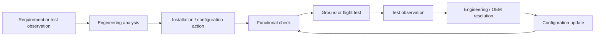

# Verification & Flight Test

The surviving project archive documents a genuine prototype-test-feedback cycle rather than a one-time installation.

## First modified aircraft

Original project photographs from **November 2010** show the Dynon SkyView installation on the first modified aircraft. The public versions used by this repository are cropped/redacted only to remove organizational or privacy identifiers.

No synthetic cockpit or aircraft imagery is used.

## First-sortie evidence

December 2010 correspondence records that the displays had been installed, databases loaded, and the aircraft had **flown its first sortie**. The subsequent OEM response explicitly asked the team to continue reporting results as flight testing progressed.

This provides a direct evidence chain:

**hardware/configuration work → aircraft installation → flight → OEM feedback loop**

## Technical issues were closed through evidence

The archive includes engineering questions and troubleshooting around topics such as:

- avionics data interfaces;
- electrical-transient behaviour;
- database/configuration management;
- display and sensor behaviour;
- third-party navigation/communication integration;
- qualification and maintainability;
- post-installation and flight-test support.

The public repo intentionally omits controlled implementation detail.

## 2012 operational/customer evaluation

A surviving 2012 status exchange records **10 evaluation sorties**, including **night flying**, with another night sortie planned. This is stronger evidence than a generic statement that the system was “flight tested”: it shows repeated operation in an evaluation environment after prototype maturation.

Customer identity, location, private correspondence and internal action sheets are not reproduced here.

## Retrospective verification workflow

The following is a retrospective systems-engineering abstraction reconstructed from the surviving records. It is **not** presented as an original programme diagram.

## Why this matters

Retrofit V&V is dominated by interfaces and configuration. A display can function correctly on the bench and still expose aircraft-level issues when connected to real sensors, power, radios, databases and pilot workflows.

The surviving evidence shows the programme progressing through that integration reality rather than stopping at laboratory demonstration.

See [Evidence & Provenance](evidence-and-provenance.md) for the evidence register.
